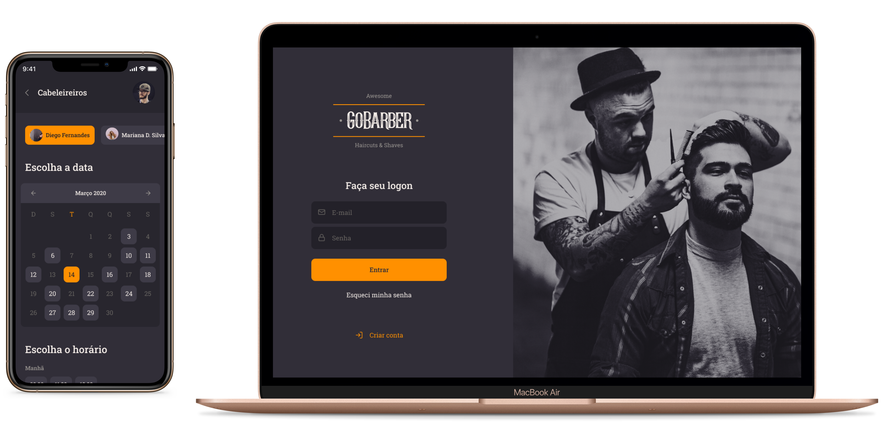

<h1 align="center">
	
</h1>

The project is organized in 3 different repositories.

Here are the links to them:
  - [API](https://github.com/CaioMantovaniBorba/gobarber-api)
  - [Web](https://github.com/CaioMantovaniBorba/gobarber-web)
  - [Mobile](https://github.com/CaioMantovaniBorba/gobarber-mobile)
